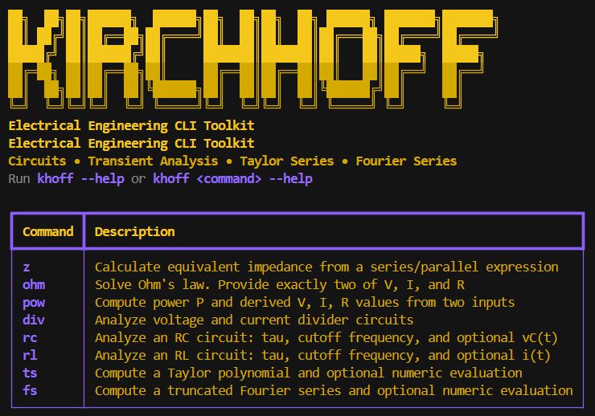
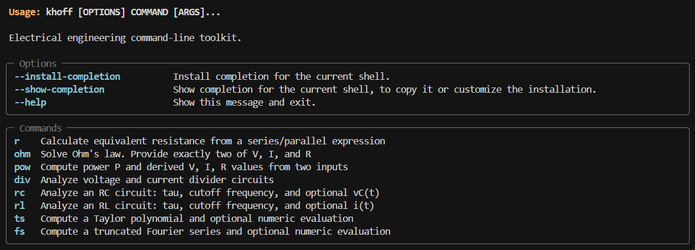

# Kirchhoff CLI

A Python command-line toolkit for circuit analysis and engineering mathematics.

Kirchhoff CLI provides fast terminal-based utilities for common electrical engineering calculations, including equivalent resistance, Ohm’s law, power, voltage and current dividers, RC/RL transient analysis, Fourier series, and Taylor expansions.

<p align="center">
  
</p>

## Features

- Equivalent impedance for series/parallel expressions, including complex networks
- Ohm's law and power calculations from two known values
- Voltage and current divider analysis
- RC and RL transient helpers with time constant and cutoff frequency
- Taylor polynomial and Fourier series calculations powered by SymPy
- SI prefix parsing for common electrical units, including `k`, `M`, `m`, `u`, `µ`, `n`, and `p`

## Requirements

- Python 3.10 or newer
- A terminal on Windows, macOS, or Linux

## Installation

The recommended way to install a Python CLI tool is with `pipx`, because it keeps the command isolated from your system Python while making it available globally.

Install `pipx` by following the official guide:

[https://pipx.pypa.io/stable/installation/](https://pipx.pypa.io/stable/how-to/install-pipx/)

Then install this tool from GitHub:

```bash
pipx install git+https://github.com/leandro-3rne/kirchhoff-cli.git
```

You can also clone the repository and install it locally:

```bash
git clone https://github.com/leandro-3rne/kirchhoff-cli.git
cd kirchhoff-cli
pipx install .
```

After installation, verify that the command is available:

```bash
khoff --help
```

## Usage

Run `khoff` without arguments to show the banner and command overview:

```bash
khoff
```

<p align="center">
  
</p>

### Impedance

```bash
khoff z --r "1k + (2k || 3k)"
khoff z --freq 78kHz "(5 + 8j) || (6 - 1/8j)"
khoff z --omega 5 "3ohm || jomega3kH/(j*omega*5f)"
khoff z --freq 80kHz "7 - jomega4H/-jomega8kH"
khoff z --c "5 + 3f"
khoff z --l "5h || 8kH"
khoff z --c "5 + 3f" --omega 10
khoff z --l "5h || 8kH" --freq 2kHz
```

Notes:
- `--r`, `--c`, and `--l` are passive-network modes and support component terms combined with `+` and `||` only.
- For full formulas with `j`, `omega`, multiplication/division, and subtraction, use the general positional impedance mode:
  `khoff z --omega 5 "3ohm || jomega3kH/(j*omega*5f)"`.

### Ohm's Law

Provide exactly two of voltage, current, and resistance:

```bash
khoff ohm --v 5V --r 220
khoff ohm --i 20mA --r 1k
```

### Power

```bash
khoff pow --v 5V --i 20mA
khoff pow --i 10mA --r 1k
```

### Dividers

Voltage divider:

```bash
khoff div v --r1 10k --r2 4.7k --vin 5V
```

Current divider:

```bash
khoff div i --r1 100 --r2 220 --iin 10mA
```

### RC and RL Transients

```bash
khoff rc --r 10k --c 100nF --vin 5V --t 2ms
khoff rl --r 100 --l 10mH --vin 5V --t 1ms
```

### Taylor Series

```bash
khoff ts "exp(x)" --order 5
khoff ts "sinx + cosh" --around 0 --order 5 --value 0.2
khoff ts "ln(1+x) + squarex" --order 4
```

### Fourier Series

```bash
khoff fs "sin(x)" --period "2*pi" --order 5
khoff fs "x" --period "2*pi" --order 3
khoff fs "sawtoothx + trianglex" --period "2*pi" --order 7
khoff fs "heaviside(sin(x))" --period "2*pi" --order 9
```

Symbolic aliases:
- `ln(...)` is supported as an alias for `log(...)`.
- `square(x)` / `squarex` denote a periodic square wave.
- `sawtooth(...)`, `triangle(...)`, and `heaviside(...)` are supported for Fourier use.
- For Taylor series, discontinuous/non-smooth terms (e.g. `square`, `heaviside`, `sawtooth`, `triangle`) raise a clear error.

## Supported Value Syntax

Values can be entered with or without units:

```text
220
4.7k
10mA
100nF
2ms
3.3V
1.5uF
3µF
```

Supported unit families include resistance, voltage, current, capacitance, inductance, time, and frequency (Hz).

## Development

Clone the repository:

```bash
git clone https://github.com/<your-user>/kirchhoff-cli.git
cd kirchhoff-cli
```

Create and activate a virtual environment:

```bash
python -m venv .venv
```

Windows PowerShell:

```powershell
.venv\Scripts\Activate.ps1
```

macOS/Linux:

```bash
source .venv/bin/activate
```

Install the package and test dependency:

```bash
pip install -e .
pip install pytest
```

Run the test suite:

```bash
pytest
```

If you use `uv`, you can also run:

```bash
uv sync --dev
uv run pytest
```

## Project Structure

```text
src/kirchhoff/
  cli.py          CLI commands and terminal output
  circuits.py     Circuit formulas
  resistance.py   Impedance/resistance expression parser
  symbolic.py     Taylor and Fourier helpers
  units.py        SI value parsing and formatting
tests/            Pytest test suite
```

## License

This project is licensed under the MIT License.
